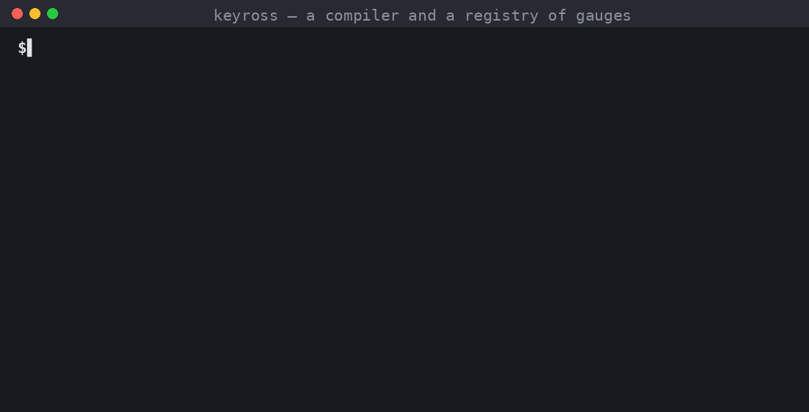
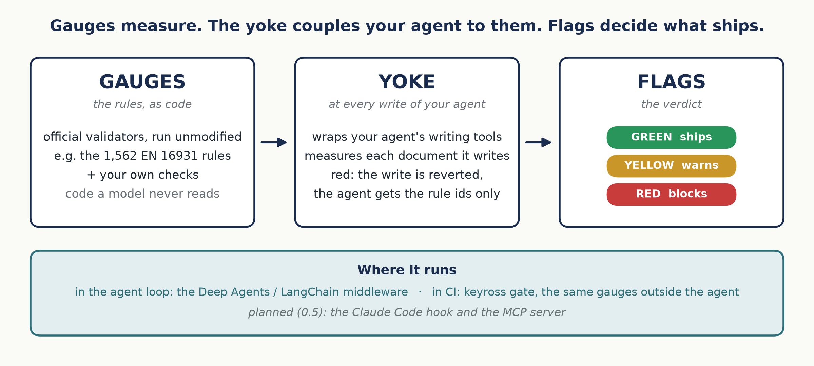
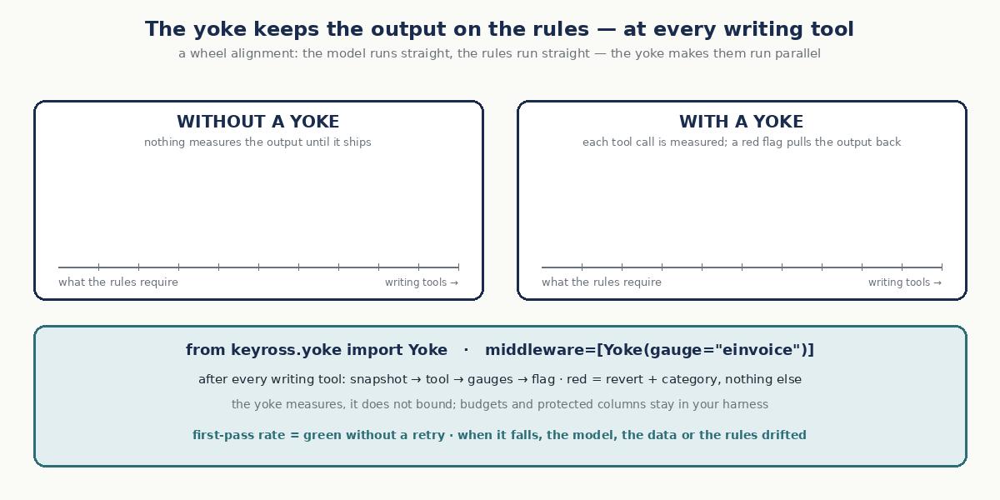

# Keyross — un compilateur et un registre de gauges pour les documents de ton agent

> Ton agent sait déjà lire, planifier et éditer. Ce qu'il n'a pas, c'est un **compilateur** : quelque chose de déterministe qui dit si ce qu'il a produit est juste — après chaque action, en quelques secondes, sans modèle dans la boucle de vérification.
>
> **Les gauges mesurent. Le yoke y attelle ton agent. Les flags décident de ce qui part.**



## Un exemple : une facture électronique

EN 16931 est la norme européenne de la facture électronique, la base des obligations qui se déploient dans l'UE (en France depuis septembre 2026). Ses règles sont publiques : le CEN les publie sous forme d'artefacts de validation officiels — 1 562 identifiants de règles, par exemple **BR-CO-10** *la somme des lignes de la facture égale le total des lignes* ou **BR-E-10** *une ligne exonérée indique le motif de son exonération*. Le gauge `einvoice` exécute ces artefacts sans modification ; Keyross n'en réécrit aucune.


Un agent reçoit une commande — 3 chaises de bureau à 49,90 HT, TVA 20 % — et écrit la facture. Il se trompe sur le total des lignes : 150,70 au lieu de 149,70. Avec le yoke, l'écriture est mesurée aussitôt : BR-CO-10 et BR-CO-13 tombent, le fichier est restauré, et l'agent reçoit une seule ligne — `red flag: BR-CO-10, BR-CO-13 — the write was reverted; fix and retry` — puis réécrit la facture, juste. Le modèle ne voit jamais le texte des règles ni les preuves : ce sont les règles officielles qui décident, pas le modèle. Sans yoke, rien ne mesure la facture : elle part.

À essayer hors ligne : `python examples/deepagents/invoice_agent.py`.

**Mesuré.** Dans un benchmark pré-enregistré — le même agent, 300 runs, jugés par des juges qui ne sont pas Keyross — 50 factures sur 100 partaient fausses sans le yoke, sans que rien ne le signale. Avec le yoke sur les règles officielles et la commande : 11, toutes des erreurs de schéma XML, que le yoke ne vérifie pas encore. Les factures correctes passent de 50 % à 64 % avec les seules règles officielles (p = 0,005 après correction de Holm). Les résultats et les données brutes : [bench/einvoice](bench/einvoice/README.md) · la page, avec un calculateur de coûts : [keyross-oss.github.io/keyross/bench/](https://keyross-oss.github.io/keyross/bench/).

## Pourquoi ce dépôt existe

Pour **rendre les agents responsables devant les compilateurs que les documents officiels ont déjà — et écrire ceux qui manquent.** Les standards officiels livrent leurs propres validateurs (les règles du CEN pour la facture EN 16931, celles des ESAs pour le registre DORA) ; Keyross ne les réécrit jamais. Il les exécute comme des gauges — épinglés, exécutés hors du modèle, rejoués en CI — et ajoute les contrôles qu'un standard ne peut pas connaître : tes données de référence, la cohérence entre documents, les contrats des propres actions de l'agent. Voir [GAUGES.md](GAUGES.md) pour les gauges et les premières contributions.

**Pense pre-commit, pour les sorties d'agents.** pre-commit n'a écrit aucun linter ; il a mis tous les linters au même endroit, épinglés, avec une config et une commande. Keyross fait de même pour les contrôles que les documents d'un agent doivent passer : une config, un lock, un rapport, un exit code.

## En cinq minutes

```bash
pip install "keyross[einvoice]"
keyross init                  # keyross.yaml, oracles/, badset/
keyross check facture.xml     # une facture EN 16931 (UBL / CII) → les règles officielles du CEN → green / yellow / red, exit 0 / 1 / 2
keyross check devis.xlsx      # un devis ou tout tableau chiffré → le gauge core
keyross test                  # chaque oracle attrape-t-il son cas faux ? (les tests des tests)
keyross lint                  # refuse un oracle qui appelle un modèle ou le réseau
keyross lock                  # épingle les oracles : la réponse à « qu'est-ce qui vérifiait ce run ? »
```

## Ce que c'est, en trois mots

Les trois mots restent en anglais, comme dans le code.



| Mot | Ce que c'est | Analogie avec le code |
|---|---|---|
| **Gauge** | Les règles, en code : un ensemble installable et versionné de contrôles déterministes pour une famille de documents — validateurs officiels exécutés sans modification, contrôles maison ajoutés. Écrits par des humains, jamais appris ; un modèle ne les lit jamais. | le compilateur, la suite de tests |
| **Yoke** | Ce qui attelle l'agent à ses gauges : il mesure chaque document que l'agent écrit, annule une écriture red et ne renvoie que les identifiants des règles. Une middleware LangChain / Deep Agents aujourd'hui ; un hook Claude Code et un serveur MCP prévus. | le runner de tests branché sur le build |
| **Flags** | Le verdict : **green** part, **yellow** avertit, **red** bloque. Les mêmes flags dans la boucle de l'agent et en CI, où `keyross gate` rejoue chaque gauge hors de l'agent (le scrutineering) : exit 0 / 1 / 2. | les erreurs et warnings du compilateur |

Claude Code est fiable parce que le code a un compilateur, des tests et une CI. Tes documents métier — devis, factures, sinistres, dossiers KYC — n'ont rien de tout ça. Keyross l'écrit. → [MANIFESTO.fr.md](MANIFESTO.fr.md)

## Le yoke

Une ligne attelle un agent à ses gauges :

```python
from keyross.yoke import Yoke
agent = create_deep_agent(..., middleware=[Yoke(gauge="einvoice")])   # Deep Agents / LangChain
```

Pense au parallélisme des roues. Le modèle roule droit ; les règles roulent droit ; sans yoke, ils ne roulent pas *parallèles*, et la sortie dérive un peu à chaque étape — jusqu'à ce qu'une erreur parte avec une phrase confiante. Le yoke mesure après chaque outil d'écriture : red = revert et retry — un pit stop — et seuls les identifiants des règles reviennent ; green = on continue. Dans le temps, le **first-pass rate** — green sans retry, `keyross stats` — est la santé du système : s'il baisse, le modèle, les données ou les règles ont dérivé.



Le yoke mesure ; il ne borne pas : budgets et colonnes protégées restent dans ton harness. Fonctionnement, backends, agents LangChain simples : [src/keyross/yoke](src/keyross/yoke/README.md).

## Un gauge n'est pas un skill, un prompt ni un fichier d'instructions

Un skill Claude Code, un prompt système, un `CLAUDE.md` : du texte qu'un modèle lit et suit, ou pas. Un gauge est l'inverse : **du code qu'un modèle ne lit jamais**. *Un skill demande. Un gauge mesure.*

| | Un skill / prompt | Un gauge |
|---|---|---|
| Ce que c'est | des instructions à un modèle | du code : contrôles, validateurs officiels, cas faux qui les testent |
| Qui l'exécute | le modèle, à sa discrétion | le harness, la CI — jamais le modèle |
| Résultat | un comportement, probabiliste | un verdict, déterministe : le même document, le même flag, toujours |
| L'agent le voit-il ? | oui, il est dans son contexte | non — il reçoit un flag et les identifiants des règles |

## Le registre

Les règles vivent dans des gauges — versionnés, testés contre leurs cas faux, mis à jour depuis un seul endroit ; un gauge connaît la révision du standard qu'il implémente. Pense au registre de règles de Semgrep, pour les documents.

```bash
keyross gauges                # gauges installés vs le registre
keyross add einvoice          # installe un gauge, l'épingle dans keyross.lock
keyross outdated              # sommes-nous sur les dernières règles ?
```

`update` et `audit` arrivent en 0.3, les gauges signés en 0.4. Format : [docs/spec/gauge.md](docs/spec/gauge.md).

## Le brancher dans une stack

| Niveau | Comment | État |
|---|---|---|
| 0 — scrutineering en CI | `keyross gate outputs/ --fail-on hard` : chaque gauge rejoué hors de l'agent, un exit code, comme pytest | livré |
| 1 — le yoke, dans la boucle | `Yoke(gauge=...)` dans un agent Deep Agents ou LangChain — `pip install "keyross[yoke]"` | livré |
| 2 — le hook Claude Code | un hook `PostToolUse` lance `keyross check` sur chaque fichier écrit par l'agent — du code exécuté par le harness, pas un skill | 0.5 |
| 3 — le yoke, en service | `keyross serve --mcp`, appelé par la plateforme, invisible pour le modèle | 0.5 |

Rien n'exige de compte, de cloud ni de cluster. Tout tourne en local. Où se trouve chaque porte et ce qui en sort : [docs/ARCHITECTURE.md](docs/ARCHITECTURE.md).

## Pour aller plus loin

- [docs/CONCEPTS.md](docs/CONCEPTS.md) — invariants, contrats et sentinelles ; les flags, dont le noir ; les règles imposées par l'outil ; écrire un oracle
- [docs/ARCHITECTURE.md](docs/ARCHITECTURE.md) — où tournent les gauges, ce qui sort de chaque porte
- [bench/einvoice](bench/einvoice/README.md) — le même agent sans yoke, avec les règles officielles, puis avec les règles et la commande, jugé par des juges qui ne sont pas Keyross ; protocole pré-enregistré
- [GAUGES.md](GAUGES.md) · [CONTRIBUTING.md](CONTRIBUTING.md) · [GOVERNANCE.md](GOVERNANCE.md) · [SECURITY.md](SECURITY.md)

## État et feuille de route

`0.1` — check, gate, test, lint, lock, rapport, doctor statique ; le gauge `core` et le gauge homologué [`einvoice`](src/keyross/gauges/einvoice/README.md) (les artefacts officiels du CEN EN 16931 1.3.16, exécutés sans modification, et des oracles delta : la facture contre sa commande) ; le yoke Deep Agents / LangChain et `keyross stats` · `0.2` — l'étape du schéma XML dans `einvoice`, le PDF Factur-X, d'autres oracles delta (données fournisseur, le contrat `issue_invoice`) · `0.3` — gauges depuis git, `update` / `audit`, le seal · `0.4` — gauges signés, doctor sur cluster jetable, action CI · `0.5` — le hook et le plugin Claude Code, le serveur MCP · puis `dora.register`, `aiact.annex4`, `governance`.

Ce dépôt se vérifie lui-même : sa CI lance `keyross test`, `keyross lint` et `keyross lock --check` à chaque commit.

*English version: [README.md](README.md) · [MANIFESTO.md](MANIFESTO.md)*

## Licence

[Apache-2.0](LICENSE). Le moteur et les gauges publics sont ouverts ; contributions sous Developer Certificate of Origin (`git commit -s`), pas de CLA. Les gauges sectoriels écrits en mission appartiennent au client, sauf s'ils sont généralisés et reversés.
