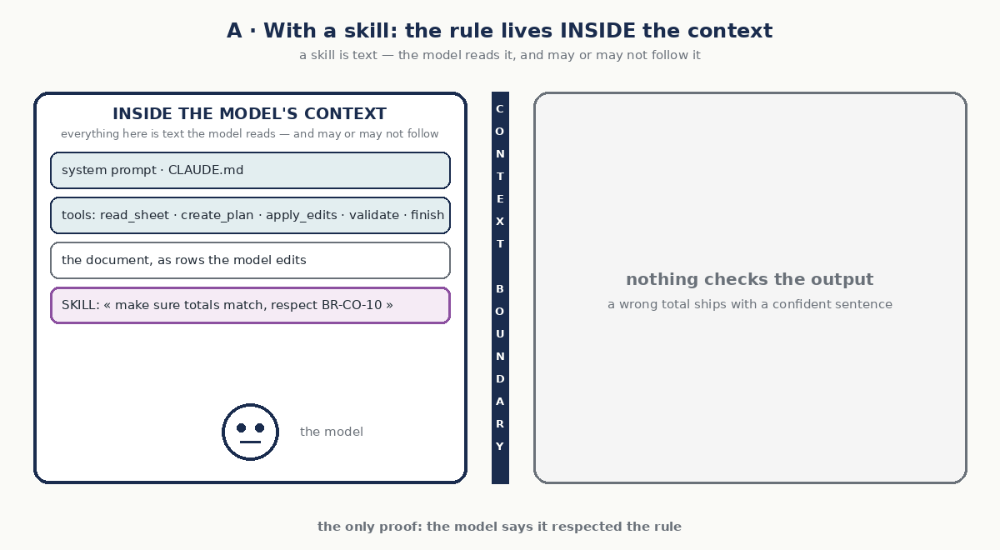
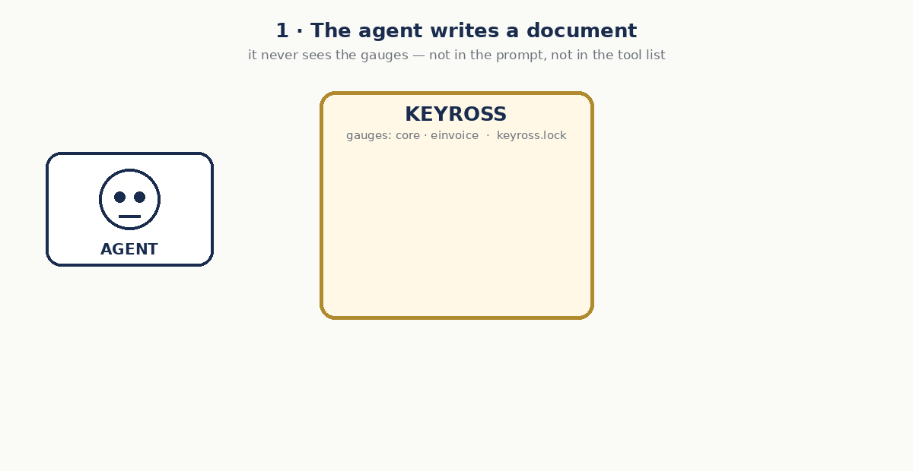

# Keyross — un compilateur et un registre de gauges pour les documents de ton agent

> Ton agent sait déjà lire, planifier et éditer. Ce qu'il n'a pas, c'est un **compilateur** : quelque chose de déterministe qui dit si ce qu'il a produit est juste — après chaque action, en secondes, sans modèle dans la boucle de vérification.
>
> *In 2026, agents learned to compile their plans. Nobody compiles their outputs.*


## Pourquoi ce dépôt existe

Pour **rendre les agents responsables devant les compilateurs que les documents officiels ont déjà — et écrire ceux qui manquent.** Les standards officiels livrent leurs propres validateurs (le Schematron CEN pour la facture EN 16931, les règles des ESAs pour le registre DORA) ; Keyross ne les réécrit jamais. Un gauge enveloppe le validateur officiel comme un oracle — épinglé, exécuté par le harness, retour minimal à l'agent, rejoué à la gate — et ajoute ce que le standard ne peut pas savoir : la cohérence entre documents, vos référentiels, les contrats des actions de l'agent. Voir [GAUGES.md](GAUGES.md) pour l'ordre des gauges et les premières contributions.

**Le vocabulaire est anglais, un mot par pièce** : *gauge* — l'instrument installable, un ensemble d'oracles calibrés pour une famille de documents, homologué sur les validateurs officiels ; *yoke* — ce qui attelle l'agent à ses gauges (middleware, hook Claude Code, serveur MCP) ; *flags* — vert, jaune, rouge, noir ; *scrutineering* — la gate, tout rejoué hors de l'agent ; *seal* — le run scellé, lock et attestation ; *telemetry* — les événements de chaque run.

**Le produit, c'est le registre** : tous les oracles documentaires agrégés dans des gauges versionnés, testés, signés, mis à jour depuis un seul endroit — `keyross add einvoice`, `keyross outdated`. Comme le registre de règles de Semgrep, pour les documents.

**Pensez pre-commit, pour les sorties d'agents.** pre-commit n'a écrit aucun linter ; il a mis tous les linters au même endroit, épinglés, avec une config et une commande. Keyross met tous les oracles qu'un agent doit satisfaire au même endroit : validateurs officiels adaptés (les `adapters/` de chaque gauge), oracles maison ajoutés (`oracles/`), un contrat de verdict, un lock, une gate, un rapport, un exit code.

## En cinq minutes

```bash
pip install keyross
keyross init                  # keyross.yaml, oracles/, badset/
keyross check devis.xlsx      # les oracles du gauge core sur une sortie → exit 0 / 1 / 2
keyross check facture.xml     # une facture EN 16931 (UBL / CII) → les règles officielles du CEN — pip install "keyross[einvoice]"
keyross test                  # chaque oracle attrape-t-il son cas faux ? (les tests des tests)
keyross lint                  # refuse un oracle qui appelle un modèle ou le réseau
keyross lock                  # épingle les oracles : la réponse à « qu'est-ce qui vérifiait ce run ? »
keyross doctor .              # l'agent est-il prêt pour un cluster ? (v0.1 : contrôles statiques)
```

Un oracle tient en huit lignes — une fonction pure, un verdict, des preuves :

```python
from keyross import oracle, Verdict

@oracle("invoices.total.matches", severity="hard")
def total_matches(doc):
    expected = sum(l.amount for l in doc.amount_lines())
    if abs(doc.lines[-1].amount - expected) > 0.01:
        return Verdict.fail("total ≠ somme des lignes", "totals.mismatch", expected=expected)
    return Verdict.ok()
```

## Un exemple : une facture électronique

EN 16931 est la norme européenne de la facture électronique, la base des obligations qui se déploient dans l'UE (en France depuis septembre 2026). Ses règles sont publiques : le CEN les publie sous forme d'artefacts de validation officiels — 1 562 identifiants de règles, par exemple **BR-CO-10** *la somme des lignes de la facture égale le total des lignes* ou **BR-E-10** *une ligne exonérée indique le motif de son exonération*. Le gauge `einvoice` exécute ces artefacts sans modification ; Keyross n'en réécrit aucune.


Un agent reçoit une commande — 3 chaises de bureau à 49,90 HT, TVA 20 % — et écrit la facture. Il se trompe sur la somme des lignes : 150,70 au lieu de 149,70. Avec le yoke, l'écriture est mesurée aussitôt : BR-CO-10 et BR-CO-13 tombent, le fichier est restauré, et l'agent reçoit une seule ligne — `red flag: BR-CO-10, BR-CO-13 — the write was reverted; fix and retry` — puis réécrit la facture, juste. Le modèle ne voit jamais le texte des règles, les preuves ni la liste des règles : ce sont les règles officielles qui décident, pas le modèle. Sans yoke, rien ne mesure la facture : elle part.

À essayer hors ligne : `python examples/deepagents/invoice_agent.py` — un agent scripté fait ce genre d'erreur, sans puis avec le yoke. La mesure sur un vrai modèle : [bench/einvoice](bench/einvoice/README.md) — 20 commandes, deux juges hors de l'agent.

## Ce que c'est, en trois mots

| Mot | Définition | Analogie avec le code |
|---|---|---|
| **Gauge** | L'instrument installable : un ensemble versionné et calibré d'oracles — des tests déterministes, rouge ou vert, avec preuves — pour une famille de documents. Validateurs officiels adaptés (*homologués*), oracles maison ajoutés. Écrits par des humains, jamais appris. | le compilateur, le typage, la suite de tests |
| **Yoke** | Ce qui attelle l'agent à ses gauges : une middleware dans la boucle, un hook Claude Code, un serveur MCP. Le modèle ne le lit jamais ; il ne reçoit qu'un flag et une catégorie. | le runner de tests branché sur le build |
| **Scrutineering** | Tous les gauges rejoués sur ce qui sort, **hors de l'agent**, depuis un sandbox neuf, avec un exit code. Rien n'est livré sans son vert. | la CI |

Claude Code est fiable parce que le code a un compilateur, des tests et une CI. Vos documents métier — devis, factures, sinistres, dossiers KYC — n'ont rien de tout ça. Keyross l'écrit. → [MANIFESTO.md](MANIFESTO.md)

## Un gauge n'est pas un skill, un prompt ni un fichier d'instructions

Un skill Claude Code, un prompt système, un `CLAUDE.md` : du texte qu'un modèle lit et suit — ou pas. Un gauge est l'inverse : **du code qu'un modèle ne lit jamais**. *A skill asks. A gauge measures.*



| | Un skill / prompt | Un gauge |
|---|---|---|
| Ce que c'est | du texte, des instructions à un modèle | du code : des oracles (fonctions pures), des adaptateurs qui exécutent des validateurs officiels, des cas faux qui les testent |
| Qui l'exécute | le modèle, à sa discrétion | le harness, la CI, la gate — jamais le modèle |
| Résultat | un comportement, probabiliste | un verdict, déterministe : le même document donne le même rouge ou vert, toujours |
| Sur une règle du standard | « merci de respecter BR-CO-10 » | le Schematron officiel EN 16931, épinglé par version et empreinte, exécuté |
| L'agent peut-il le voir ? | oui, il est dans son contexte | non — ni dans le prompt, ni dans la liste d'outils ; il reçoit un flag + une catégorie |
| Preuve | aucune | le verdict, le lock, le rapport, le seal |

`keyross lint` refuse un gauge qui importe un client de modèle ou le réseau ; un gauge qui livre un fichier de prompt n'est pas un gauge. C'est tout le sujet : une vérification qu'on peut présenter à un auditeur est du code avec des règles publiées, pas un souhait adressé à un modèle.

## Le yoke

Le yoke est ce qui attelle l'agent à ses gauges — et la ligne qui fait passer un agent de *l'espoir* à *la mesure* :

```python
from keyross.yoke import Yoke
agent = create_deep_agent(..., middleware=[Yoke(gauge="einvoice")])   # Deep Agents / LangGraph
```

Pense au parallélisme des roues. Le modèle roule droit ; les règles roulent droit ; sans yoke, ils ne roulent pas *parallèles*, et la sortie dérive un peu à chaque étape — jusqu'à ce qu'une erreur parte avec une phrase confiante. Le yoke mesure après chaque outil d'écriture : snapshot → outil → gauges → flag. Rouge = revert et retry (un pit stop, si on veut), et seule la catégorie revient. Vert = on continue. Dans le temps, le **first-pass rate** — vert sans retry — est la santé du système : s'il baisse, le modèle, les données ou les règles ont dérivé.


Le yoke mesure ; il ne borne pas. Budgets, colonnes protégées, plafonds de suppression restent dans le harness (ses limiters). Trois yokes : la middleware Deep Agents / LangGraph, le hook `PostToolUse` de Claude Code, le serveur MCP (mode garde) — `keyross yoke <harness>` imprime la recette.

À essayer hors ligne : `python examples/deepagents/invoice_agent.py` fait tourner le même agent sans puis avec le yoke — un total faux part, puis il est attrapé, annulé et corrigé. Avec une telemetry, `keyross stats` affiche le first-pass rate.

## Où tournent les gauges




Deux yokes — **dans la boucle** (la middleware Deep Agents / LangGraph, le hook Claude Code), **en service** (MCP, appelé par la plateforme) — et le **scrutineering** (`keyross gate` en CI, sans agent) : les mêmes gauges, le même lock, les mêmes flags. Le schéma complet, avec les modes garde et outil de MCP et ce qui sort de chaque porte : [docs/ARCHITECTURE.md](docs/ARCHITECTURE.md).

## Trois familles d'oracles

- **Invariants** — indépendants du plan : le total égale la somme des lignes, aucune ligne chiffrée n'a disparu, les unités sont dans le vocabulaire. Le gauge `core` en livre six.
- **Contrats par action** — dérivés du plan : `@contract("delete_rows")` vérifie que l'action a fait exactement ce qu'elle annonçait, instancié par le harness avec les paramètres de la tâche. L'agent ne peut tester que ce qu'il a annoncé.
- **Sentinelles** — `@oracle(..., silent=True)` : silencieuses, sans retour à l'agent, à poids nul. Un vert visible et un rouge silencieux, c'est la signature d'un contournement.

## Les flags

Chaque verdict porte un flag : **green** (ok), **yellow** (échec souple — signale, exit 1), **red** (échec dur — bloque, exit 2). Le scrutineering lève le **black** flag quand l'agent a dit vert et que la gate a trouvé rouge : un incident d'intégrité, le run est mis en quarantaine. `hard` / `soft` restent les valeurs du JSON ; les flags sont ce que les gens lisent.

## Les règles que l'outil rend impossibles à violer

- `keyross lint` **refuse** un oracle qui importe un client de modèle, du réseau, ou une source de non-déterminisme.
- Le retour à l'agent est **minimal** : rouge ou vert et la catégorie de l'écart — jamais la logique, le seuil, la liste des oracles ni les preuves (`Verdict.minimal()`).
- Un oracle sans cas faux dans `badset/` est un échec de `keyross test` : un test qu'on ne teste pas ment un jour.
- Un oracle qui plante est un rouge dur : on ne devine pas.

## Le brancher dans une stack

| Niveau | Comment | Temps |
|---|---|---|
| 0 — le scrutineering en CI | `keyross gate outputs/ --fail-on hard` — exit code, comme pytest | 10 min |
| 1 — le yoke, dans la boucle | `Yoke(gauge="core")` pour Deep Agents / LangChain : vérifie après chaque outil d'écriture, revert si rouge, retour minimal — `pip install 'keyross[yoke]'` | 1 h |
| 2 — le yoke, en service | `keyross serve --mcp` : l'outil `verify` en mode garde, appelé par le harness *(v0.5)* | 1 h |
| 3 — l'audit | `keyross audit` : le rapport en neuf sections et le gauge governance sur la telemetry *(0.3)* | 1 jour |

Rien n'exige un compte, un cloud, un cluster ou une modification de l'agent pour commencer. Tout tourne en local.

## Écrire un oracle

Un oracle est une fonction **pure** : `(document, contexte) -> Verdict`. Pas d'état, pas d'effet de bord, pas de réseau, pas de modèle. Le document canonique expose des lignes à identifiants stables (`rid:12`), des blocs (lignes chiffrées + sous-total), et les colonnes reconnues. Le contexte porte ce que le client fournit — vocabulaire d'unités, document de référence, type de document.

Chaque oracle a un **identifiant** (`gauge.sujet.propriete`), une **version**, une **sévérité** (`hard` bloque, `soft` signale) et un **cas faux** dans `badset/<id>.xlsx`. Voir [CONTRIBUTING.md](CONTRIBUTING.md).

## État et feuille de route

`0.1` — check, gauge core, test, lint, lock, rapport, doctor statique, `gauges` / `add` / `outdated` / `yoke`, et le gauge homologué [`einvoice`](src/keyross/gauges/einvoice/README.md) (les artefacts officiels du CEN EN 16931 1.3.16, exécutés sans modification), le yoke Deep Agents et `keyross stats` (first-pass rate) · `0.2` — les oracles delta `einvoice` et le PDF Factur-X · `0.3` — gauges depuis git, `update` / `audit`, le seal, doctor sur images · `0.4` — gauges signés, doctor sur cluster jetable (kind), action CI, démo en boîte · `0.5` — le yoke MCP, le hook et le plugin Claude Code · puis `dora.register`, `aiact.annex4`, `governance`.

Ce dépôt se vérifie lui-même : sa CI lance `keyross test`, `keyross lint` et `keyross lock --check` à chaque commit.

## Licence

Apache-2.0. Le moteur et le gauge core sont ouverts ; les gauges sectoriels sont l'accumulation des terrains.
