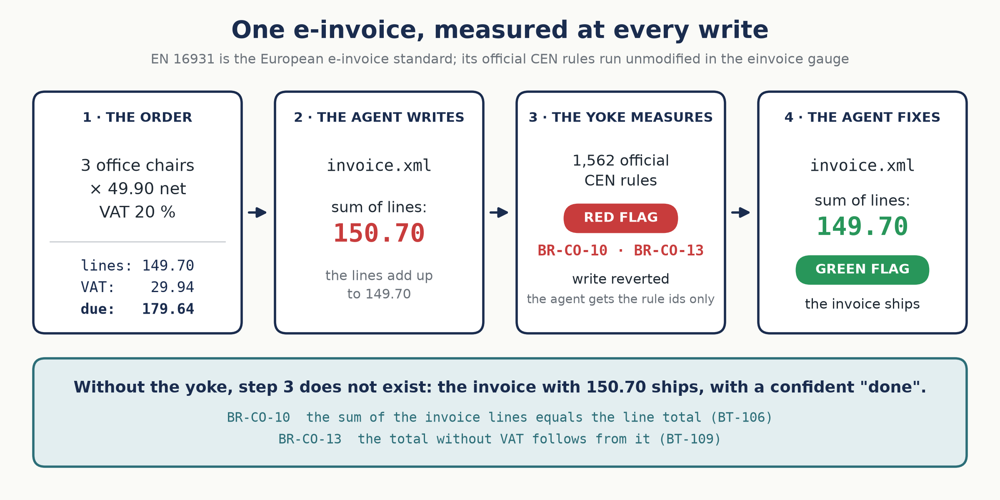

# Keyross — a compiler and a registry of gauges for your agent's documents

> Your agent already knows how to read, plan and edit. What it lacks is a **compiler**: something deterministic that says whether what it produced is right — after every action, in seconds, with no model in the verification loop.
>
> **Gauges measure. The yoke couples your agent to them. Flags decide what ships.**


## An example: one e-invoice

EN 16931 is the European standard for electronic invoices, the base of the mandates rolling out across the EU (France since September 2026). Its rules are public: CEN publishes them as official validation artefacts — 1,562 rule ids, for example **BR-CO-10** *the sum of the invoice lines equals the line total* or **BR-E-10** *an exempt line states its exemption reason*. The `einvoice` gauge runs those artefacts unmodified; Keyross rewrites none of them.



An agent receives an order — 3 office chairs at 49.90 net, VAT 20 % — and writes the invoice. It gets the line total wrong: 150.70 instead of 149.70. With the yoke, the write is measured at once: BR-CO-10 and BR-CO-13 fail, the file is restored, and the agent receives one line — `red flag: BR-CO-10, BR-CO-13 — the write was reverted; fix and retry` — then writes the invoice again, right. The model never sees the rule text or the evidence: the official rules decide, not the model. Without the yoke, nothing measures the invoice: it ships.

Run it offline: `python examples/deepagents/invoice_agent.py`. Measure it on a real model: [bench/einvoice](bench/einvoice/README.md).

## Why this repository exists

To **make agents accountable to the compilers that official documents already have — and to write the ones they don't.** Official standards ship their own validators (the CEN rules for EN 16931 e-invoices, the ESAs' rules for the DORA register); Keyross never rewrites them. It runs them as gauges — pinned, executed outside the model, replayed in CI — and adds the checks a standard cannot know: your reference data, consistency across documents, the contracts of the agent's own actions. See [GAUGES.md](GAUGES.md) for the gauges and the good first contributions.

**Think pre-commit, for agent outputs.** pre-commit wrote no linter; it put every linter in one place, pinned, with one config and one command. Keyross does the same for the checks an agent's documents must pass: one config, one lock, one report, one exit code.

## Five minutes

```bash
pip install "keyross[einvoice]"
keyross init                  # keyross.yaml, oracles/, badset/
keyross check invoice.xml     # an EN 16931 invoice (UBL / CII) → the official CEN rules → green / yellow / red, exit 0 / 1 / 2
keyross check quote.xlsx      # a quote or any priced table → the core gauge
keyross test                  # does every oracle catch its bad case? (tests for the tests)
keyross lint                  # refuse any oracle that calls a model or the network
keyross lock                  # pin the oracles: the answer to "what verified this run?"
```

## What it is, in three words


| Word | What it is | Analogy with code |
|---|---|---|
| **Gauge** | The rules, as code: an installable, versioned set of deterministic checks for one document family — official validators run unmodified, your own checks added. Written by humans, never learned; a model never reads them. | the compiler, the test suite |
| **Yoke** | What couples your agent to its gauges: it measures every document the agent writes, reverts a red write and returns only the rule ids. A LangChain / Deep Agents middleware today; a Claude Code hook and an MCP server planned. | the test runner wired into the build |
| **Flags** | The verdict: **green** ships, **yellow** warns, **red** blocks. The same flags in the agent loop and in CI, where `keyross gate` replays every gauge outside the agent (scrutineering): exit 0 / 1 / 2. | compiler errors and warnings |

Claude Code is reliable because code has a compiler, tests and CI. Your business documents — quotes, invoices, claims, KYC files — have none of that. Keyross writes it. → [MANIFESTO.md](MANIFESTO.md)

## The yoke

One line couples an agent to its gauges:

```python
from keyross.yoke import Yoke
agent = create_deep_agent(..., middleware=[Yoke(gauge="einvoice")])   # Deep Agents / LangChain
```

Think of a wheel alignment. The model runs straight; the rules run straight; without a yoke they do not run *parallel*, and the output drifts a little at every step — until an error ships with a confident sentence. The yoke measures after every writing tool: red means revert and retry — a pit stop — and only the rule ids come back; green means continue. Over time the **first-pass rate** — green without a retry, `keyross stats` — is the health of the whole system: a falling rate means the model, the data or the rules drifted.


The yoke measures; it does not bound: budgets and protected columns stay in your harness. How it works, backends, plain LangChain agents: [src/keyross/yoke](src/keyross/yoke/README.md).

## A gauge is not a skill, a prompt or an instruction file

A Claude Code skill, a system prompt, a `CLAUDE.md`: text that a model reads and may or may not follow. A gauge is the opposite: **code that a model never reads**. *A skill asks. A gauge measures.*

| | A skill / prompt | A gauge |
|---|---|---|
| What it is | instructions to a model | code: checks, official validators, bad cases that test them |
| Who runs it | the model, at its discretion | the harness, the CI — never the model |
| Result | a behaviour, probabilistic | a verdict, deterministic: the same document, the same flag, forever |
| Can the agent see it? | yes, it is in its context | no — it receives a flag and the rule ids |

## The registry

Rules live in gauges — versioned, tested against their bad cases, updated from one place; a gauge knows the revision of the standard it implements. Think Semgrep's rule registry, for documents.

```bash
keyross gauges                # installed gauges vs the registry
keyross add einvoice          # install a gauge, pin it in keyross.lock
keyross outdated              # are we on the latest rules?
```

`update` and `audit` arrive in 0.3, signed gauges in 0.4. Format: [docs/spec/gauge.md](docs/spec/gauge.md).

## Plugging it into a stack

| Level | How | Status |
|---|---|---|
| 0 — scrutineering in CI | `keyross gate outputs/ --fail-on hard`: every gauge replayed outside the agent, an exit code, like pytest | shipped |
| 1 — the yoke, in the loop | `Yoke(gauge=...)` in a Deep Agents or LangChain agent — `pip install "keyross[yoke]"` | shipped |
| 2 — the Claude Code hook | a `PostToolUse` hook runs `keyross check` on every file the agent writes — code the harness executes, not a skill | 0.5 |
| 3 — the yoke, as a service | `keyross serve --mcp`, called by the platform, invisible to the model | 0.5 |

Nothing requires an account, a cloud or a cluster. Everything runs locally. Where each door sits and what comes out of it: [docs/ARCHITECTURE.md](docs/ARCHITECTURE.md).

## Going further

- [docs/CONCEPTS.md](docs/CONCEPTS.md) — invariants, contracts and sentinels; the flags, including black; the rules the tool enforces; writing an oracle
- [docs/ARCHITECTURE.md](docs/ARCHITECTURE.md) — where the gauges run, what comes out of every door
- [bench/einvoice](bench/einvoice/README.md) — the same agent without the yoke, with the official rules, and with the rules and the order, graded by judges that are not Keyross; pre-registered protocol
- [GAUGES.md](GAUGES.md) · [CONTRIBUTING.md](CONTRIBUTING.md) · [GOVERNANCE.md](GOVERNANCE.md) · [SECURITY.md](SECURITY.md)

## Status and roadmap

`0.1` — check, gate, test, lint, lock, report, static doctor; the `core` gauge and the homologated [`einvoice`](src/keyross/gauges/einvoice/README.md) gauge (the official CEN EN 16931 artefacts 1.3.16, executed unmodified, and delta oracles: the invoice against its order); the Deep Agents / LangChain yoke and `keyross stats` · `0.2` — the XML schema step in `einvoice`, Factur-X PDF, more delta oracles (supplier master data, the `issue_invoice` contract) · `0.3` — gauges from git, `update` / `audit`, the seal · `0.4` — signed gauges, doctor on a throwaway cluster, CI action · `0.5` — the Claude Code hook and plugin, the MCP server · then `dora.register`, `aiact.annex4`, `governance`.

This repository verifies itself: its CI runs `keyross test`, `keyross lint` and `keyross lock --check` on every commit.

*Version française : [README.fr.md](README.fr.md) · [MANIFESTO.fr.md](MANIFESTO.fr.md)*

## License

[Apache-2.0](LICENSE). The engine and the public gauges are open; contributions under the Developer Certificate of Origin (`git commit -s`), no CLA. Sector gauges written on a mission belong to the client unless generalized and contributed back.
