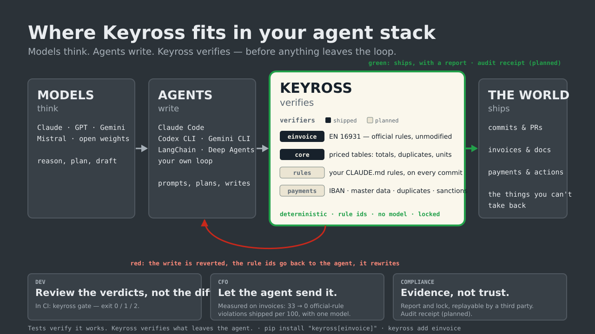
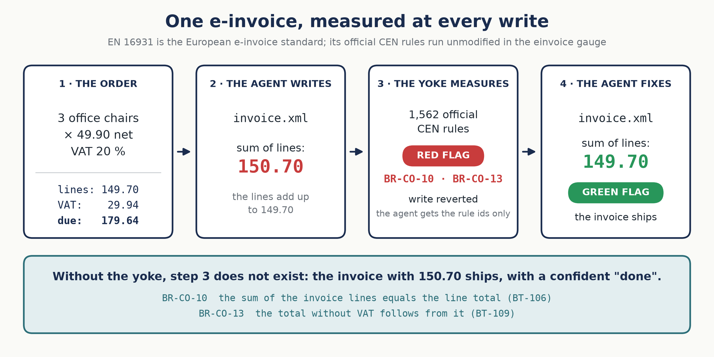
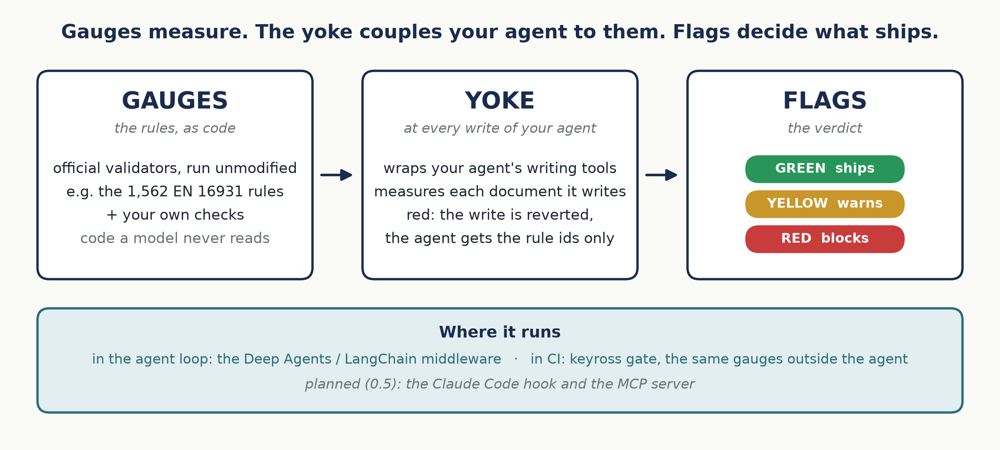

# Keyross

[](https://github.com/Keyross-oss/keyross/actions/workflows/ci.yml)
[](https://pypi.org/project/keyross/)
[](https://doi.org/10.5281/zenodo.22938584)
[](LICENSE)
[](src/keyross/gauges/einvoice/README.md)

**Ready-to-use verifiers for your agent loop.** Official rules compiled into checks your agent must pass before it acts — pinned, deterministic, replayable.

> The reference layer autonomous agents must pass before they act.



```bash
pip install "keyross[einvoice]"
keyross add einvoice          # the official EN 16931 rules, as a gauge
keyross check invoice.xml     # green / yellow / red — exit 0 / 1 / 2
```

**Not a guardrail.** A guardrail judges, probabilistically. A gauge runs the rule and returns its id. **Not a test suite either:** if pytest can test it, use pytest — Keyross verifies what leaves the agent.

## Measured on one standard: e-invoices

EN 16931 is the European standard for electronic invoices, the base of the mandates rolling out across the EU (France since September 2026). CEN publishes its rules as official validation artefacts — 1,562 rule ids, such as **BR-CO-10** *the sum of the invoice lines equals the line total*. The `einvoice` gauge runs them unmodified, offline, pinned by SHA-256; Keyross rewrites none of them. Its delta oracles add what the standard cannot know: the invoice against its order.



A pre-registered benchmark — the same agent with one model (Claude Haiku 4.5), 300 runs on 23 September 2026, graded by judges that are not Keyross:

| per 100 invoices | without Keyross | with Keyross (official rules + the order) |
|---|---|---|
| official-rule violations shipped | 33 (95 % CI 25–43) | **0** (0–4) |
| shipped wrong, nobody told | 50 | 11 — all XML schema errors, which the gauge does not check yet |
| held for a human | 0 | 29 |
| cost per invoice | 0.025 USD | 0.057 USD |

Protocol, raw data, every delivered invoice, a blind human review (21/21 agree with the judges): [bench/einvoice](bench/einvoice/README.md) · the page, with a cost model: [keyross-oss.github.io/keyross/bench](https://keyross-oss.github.io/keyross/bench/).

## On the shelf

| | Status | What it verifies |
|---|---|---|
| `einvoice` | **shipped** | EN 16931 invoices (UBL, CII — the XML of Factur-X): the official CEN rules, and the invoice against its order |
| `core` | **shipped** | priced tables — quotes, bills of quantities: totals, duplicates, units, numbering, rows conserved |
| `rules` | planned | your `AGENTS.md` / `CLAUDE.md` rules — scope, file size, tests, dependencies, public API — run on the diff, git as the only truth |
| `comments` | planned | the comments and docstrings an agent writes or leaves behind, against the code: parameters, names and references that still exist |
| `pr` | planned | a pull request's description against what git saw: the files it says it changed, the tests it says it added |
| `expense` | planned | an expense report against its receipts and the expense policy: totals, dates, ceilings, duplicates |
| `payments` | planned | a payment run against what it cannot rewrite: supplier master data, open invoices, IBAN checksum, sanctions lists |

Want one that is not here? Open a discussion in [**Wanted verifier**](https://github.com/Keyross-oss/keyross/discussions/new?category=wanted-verifier): the document your agent got wrong, and where the truth lives. More in [GAUGES.md](GAUGES.md).

## Where it plugs in

| | Status |
|---|---|
| `keyross gate <folder>` — every gauge replayed outside the agent, an exit code, in any CI | **shipped** |
| [GitHub Action](integrations/github-action/README.md) — the gate in a workflow | **shipped** |
| [The yoke](src/keyross/yoke/README.md) for Deep Agents and LangChain — every write measured, a red write reverted, only the rule ids back to the agent | **shipped** |
| `pre-commit` hook — every commit, whatever the agent | planned |
| Native hooks for Claude Code, Codex CLI, Gemini CLI | planned |
| An MCP server | later |

Nothing requires an account, a cloud or a cluster; no model and no network run during a check.

## Three words: gauge, yoke, flags



| Word | What it is |
|---|---|
| **Gauge** | the rules, as code: a versioned set of deterministic checks for one document family, tested against its bad cases and pinned by the lock. Official validators run unmodified; your own checks are added. A model never reads it. |
| **Yoke** | what couples the agent to its gauges: it measures every document the agent writes, reverts a red write and returns only the rule ids. |
| **Flags** | the verdict: **green** ships, **yellow** warns, **red** blocks — the same in the loop and in CI, exit 0 / 1 / 2. |

```python
from keyross.yoke import Yoke
agent = create_deep_agent(..., middleware=[Yoke(gauge="einvoice")])   # Deep Agents / LangChain
```

A gauge is not a skill, a prompt or a `CLAUDE.md`: those are text a model reads and may follow. A gauge is code the harness runs and the model never sees. *A skill asks. A gauge measures.*

## Five minutes

```bash
pip install "keyross[einvoice]"
keyross init                  # keyross.yaml, oracles/, badset/
keyross add einvoice          # the EN 16931 gauge: the official CEN rules, pinned
keyross check invoice.xml     # an EN 16931 invoice (UBL / CII) → green / yellow / red, exit 0 / 1 / 2
keyross check quote.xlsx      # a quote or any priced table → the core gauge
keyross test                  # does every oracle catch its bad case? (tests for the tests)
keyross lint                  # refuse any oracle that calls a model or the network
keyross lock                  # pin the oracles: the answer to "what verified this run?"
```

Every check writes a report; the lock pins what ran; `keyross gate` replays it all outside the agent. A real example to replay: [docs/audit-trail.md](docs/audit-trail.md).

## Status and roadmap

**0.1.2 (this release)** — the front page: the stack diagram, the GitHub Action, the audit trail, Discussions. Planned next, in this order — an order, not a promise of dates:

- **0.1.3** — `rules`: your `AGENTS.md` / `CLAUDE.md` rules enforced on every commit, and the `pre-commit` hook
- **0.1.4** — `payments` in `packages/`; the Claude Code hook
- **0.2** — `keyross add` copies packages from this repository's index; the XML schema step in `einvoice`; native hooks for Codex CLI and Gemini CLI; a benchmark of rules across coding agents
- **Later** — `comments`, `pr` and `expense`; `keyross new` (write a verifier, prove it on its bad cases); an MCP server

This repository verifies itself: on every commit, its CI runs the tests (one checks the table above against the benchmark's raw results), `keyross test`, `keyross lint`, `keyross lock --check` and the GitHub Action.

## Going further

- [docs/audit-trail.md](docs/audit-trail.md) — what was verified, and how a third party replays it
- [docs/CONCEPTS.md](docs/CONCEPTS.md) — invariants, contracts and sentinels; the flags; writing an oracle
- [docs/ARCHITECTURE.md](docs/ARCHITECTURE.md) — where the gauges run, what comes out of every door
- [MANIFESTO.md](MANIFESTO.md) · [GAUGES.md](GAUGES.md) · [CONTRIBUTING.md](CONTRIBUTING.md) · [GOVERNANCE.md](GOVERNANCE.md) · [SECURITY.md](SECURITY.md)

## Who maintains this

Keyross is written and maintained by [Wassim Amri](https://github.com/amri-wassim), a practitioner who builds agents for documents where an error costs money. Issues and Discussions are read; security reports go through [SECURITY.md](SECURITY.md).

## License

[Apache-2.0](LICENSE). The engine and the public gauges are open, and stay open; contributions under the Developer Certificate of Origin (`git commit -s`), no CLA. Cite it: [10.5281/zenodo.22938584](https://doi.org/10.5281/zenodo.22938584).
