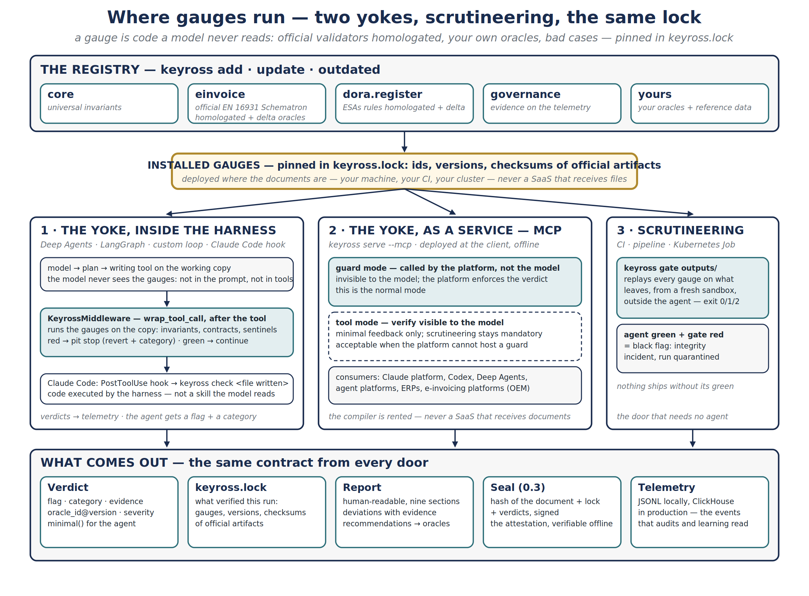

# Architecture — where the gauges run

**The registry** (`keyross add · update · outdated`) holds the gauges: `core`, `einvoice` (the official EN 16931 Schematron adapted, plus delta oracles), `dora.register`, `governance`, and yours. **Installed gauges** are pinned in `keyross.lock` — ids, versions, checksums of the official artifacts — and deployed where the documents are: your machine, your CI, your cluster. Never a SaaS that receives files.

## Three doors — two yokes and scrutineering

1. **The yoke, inside the harness.** The model plans and writes on the working copy without ever seeing the gauges — not in the prompt, not in the tool list. `KeyrossMiddleware` (`wrap_tool_call`, after the tool) runs the gauges on the copy: invariants, contracts, sentinels. Red → revert and minimal feedback (the category only); green → continue. With Claude Code, a `PostToolUse` hook runs `keyross check` on the file the agent wrote: code executed by the harness, not a skill the model reads.
2. **The yoke, as a service — MCP.** `keyross serve --mcp`, deployed at the client, offline. *Guard mode*: called by the platform's control layer, invisible to the model — the normal mode. *Tool mode*: `verify` visible to the model, minimal feedback only, the gate stays mandatory — acceptable when the platform cannot host a guard. Consumers: the Claude platform, Codex, Deep Agents, agent platforms, ERPs, e-invoicing platforms (OEM).
3. **Scrutineering — the gate.** `keyross gate outputs/` in CI, in a pipeline or as a Kubernetes Job replays every gauge on what leaves, from a fresh sandbox, outside the agent — exit 0 / 1 / 2. Agent green and gate red is an integrity incident: the run is quarantined. The door that needs no agent.

## What comes out — the same contract from every door

The **verdict** (status, category, evidence, `oracle_id@version`, severity; `minimal()` for the agent) · **keyross.lock** (what verified this run: gauges, versions, checksums of official artifacts) · the **report** (human-readable, nine sections, deviations with evidence, recommendations that name the oracle that will measure them) · the **seal** (0.3: hash of the document + lock + verdicts, signed — the attestation, verifiable offline) · the **telemetry** (JSONL locally, ClickHouse in production — the events that audits and learning read).

Formats: [spec/verdict.md](spec/verdict.md) · [spec/lock.md](spec/lock.md) · [spec/gauge.md](spec/gauge.md) · adapters: [../src/keyross/oracles/adapter.py](../src/keyross/oracles/adapter.py) · yoke: [../src/keyross/yoke/README.md](../src/keyross/yoke/README.md).
